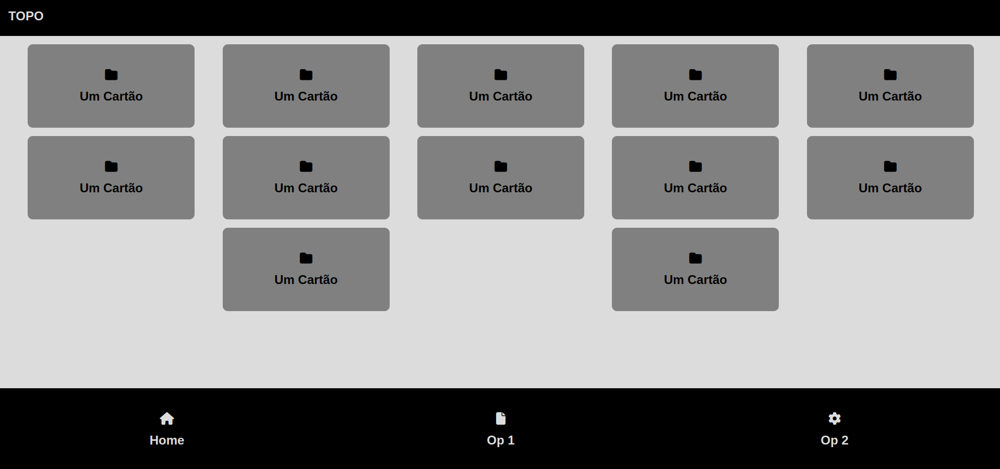

# **Tutorial \- Criação de Interfaces Responsivas com CSS Flex**

Objetivo: criação de uma interface HTML5 CSS3 responsiva para apps.

## Protótipo de interface:

Desktop  




Mobile  


1. Crie um arquivo index.html com o conteúdo:
```html

\<\!DOCTYPE html\>  
\<html\>  
\<head\>  
   \<meta charset\='utf-8'\>  
   \<meta http-equiv\='X-UA-Compatible' content\='IE=edge'\>  
   \<title\>Page Title\</title\>  
   \<meta name\='viewport' content\='width=device-width, initial-scale=1'\>  
   \<link rel\='stylesheet' type\='text/css' media\='screen' href\='main.css'\>  
   \<link rel\='stylesheet' type\='text/css' media\='screen'           
         href\='https://cdnjs.cloudflare.com/ajax/libs/font-awesome/6.6.0/css/all.min.css'\>  
   \<script src\='main.js'\>\</script\>  
\</head\>  
\<body\>  
    
\</body\>  
\</html\>  
```

Note que estamos utilizando o css do font-awesome via CDN, este estilo é utilizado para o ícones que serão inseridos na interface.

2. Crie o arquivo main.css com o conteúdo:

```css
body {  
   background: gainsboro;  
   font-family: sans-serif;  
   font-size: 1.5rem;  
   font-weight: bold;  
   margin: 0;  
   padding: 0;  
}  
```

Note o uso de ‘rem’ no tamanho da fonte, esta unidade é ‘relativa’ e indicada para uso em interfaces responsivas. Saiba mais: [https://www.w3schools.com/cssref/css\_units.php](https://www.w3schools.com/cssref/css_units.php)

3. Note que existem 3 área na interface: a)barra do topo, b)área dos cartões, e c)menu de navegação no rodapé:


4. Crie o topo com o seguinte código:  
   1. index.html \- no elemento body:
    ```html  
      \<header\>  
            \<p\>TOPO\</p\>  
      \</header\>  
     ```   
   2. main.css  
      ```css
      header{  
         background-color: black; /\* Cor de fundo\*/  
         color: gainsboro; /\* Cor do Texto\*/  
         width: 100%; /\* Ocupa toda a largura da tela\*/  
         display: flex; /\* Define que o elemento é flex\*/  
         justify-content: flex-start; /\* Alinha o conteúdo à esquerda\*/  
         padding-left: 1rem; /\* Espaçamento interna responsivo \*/  
      }  
      ```  
5. Após o elemento header vamos criar a área de cartões:  
   1. index.html
      ```html  
      \<section class\="painel-cartoes"\>  
        
      \</section\>  
      ```  
   2. main.css  
      ```css 
      .painel-cartoes{  
         display: flex;  
         justify-content: space-evenly; /\* Distribui o espaço entre os filho de maneira igual\*/  
         flex-wrap: wrap; /\* Permite que o flex defina o número de elementos por linha\*/  
         gap: 1rem; /\* Define o espaço entre os elementos filhos\*/  
         padding: 1rem;  
         margin-bottom: 15rem;  
      }
      ```  
      flex–wrap é a maneira de permitir que o navegador possa distribuir os elementos filhos de acordo com a largura da tela. É possível trabalhar em outras orientações como de cima para baixo ou da direita para esquerda. Saiba mais: [https://www.w3schools.com/cssref/css3\_pr\_flex-wrap.php](https://www.w3schools.com/cssref/css3_pr_flex-wrap.php)  
        
6. Crie um cartão dentro da section .painel-cartoes:  
   1. index.html  
      ```html
      \<div class\="cartao"\>  
            \<i class\="fa-solid fa-folder"\>\</i\>  
            Um Cartão  
      \</div\>  
      ```
      Note o elemnto \<i\> utilizado para inserir o icone do font-awesome. Saiba mais: [https://fontawesome.com/](https://fontawesome.com/)  
        
   2. main.css  
      ```css 
      .cartao {  
         width: 20rem; /\*largura responsiva\*/  
         height: 10rem; /\*altura responsiva\*/  
         background-color: gray;  
         border-radius: 10px;  
         display: flex; /\* flex para os elementos internos \*/  
         flex-direction: column; /\* elementos filho apresentados em coluna e não linha\*/  
         gap: 1rem;  
         justify-content: center; /\*filhos centralizados horizontalmente\*/  
         align-items: center; /\*filhos centralizados verticalmente\*/  
      }
      ```
     
7. Insira mais cartões, o quanto achar necessários, replicando o código HTML.  
8. Crie o menu de navegação do rodapé após o elemento section .painel-cartoes  
   1. index.html  
      ``` html
      \<footer\>  
                 \<div class\="opcao"\>  
                     \<i class\="fa-solid fa-home"\>\</i\>  
                     Home  
                 \</div\>  
                 \<div class\="opcao"\>  
                     \<i class\="fa-solid fa-file"\>\</i\>  
                     Op 1  
                 \</div\>  
                 \<div class\="opcao"\>  
                     \<i class\="fa-solid fa-gear"\>\</i\>  
                     Op 2  
                 \</div\>  
             \</footer\>
      ```      
   2. main.css
   ``` css  
      footer{  
         background-color: black;  
         color: gainsboro;  
         width: 100%;  
         height: 10rem;  
         position: fixed; /\*Mantém o elemento sempre fixo na posição\*/  
         bottom: 0; /\* define o elemento a 0 pixels da parte inferior da tela\*/  
         display: flex;  
      }  
        
      .opcao{  
         width: 100%;  
         display: flex;  
         flex-direction: column;  
         gap: 1rem;  
         justify-content: center;  
         align-items: center;  
      }
   ``` 

     
9.  Fim.

O código completo pode ser acessado em: [tutorial](https://drive.google.com/drive/folders/1dPpSmwzNMbRBPvSwEPiqrOLEBNbR4Kd1?usp=drive_link)

